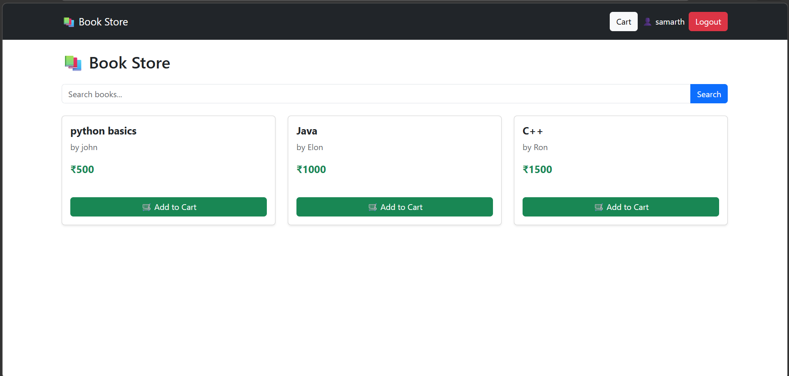
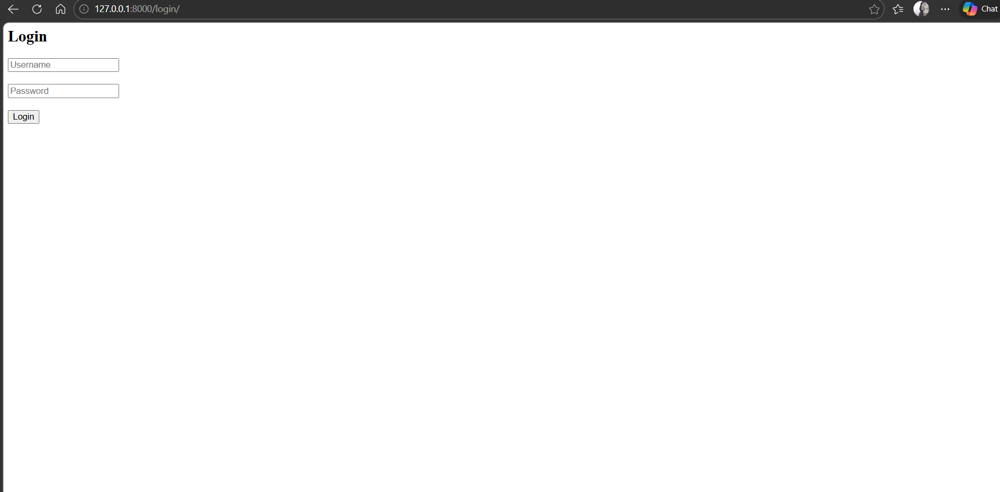
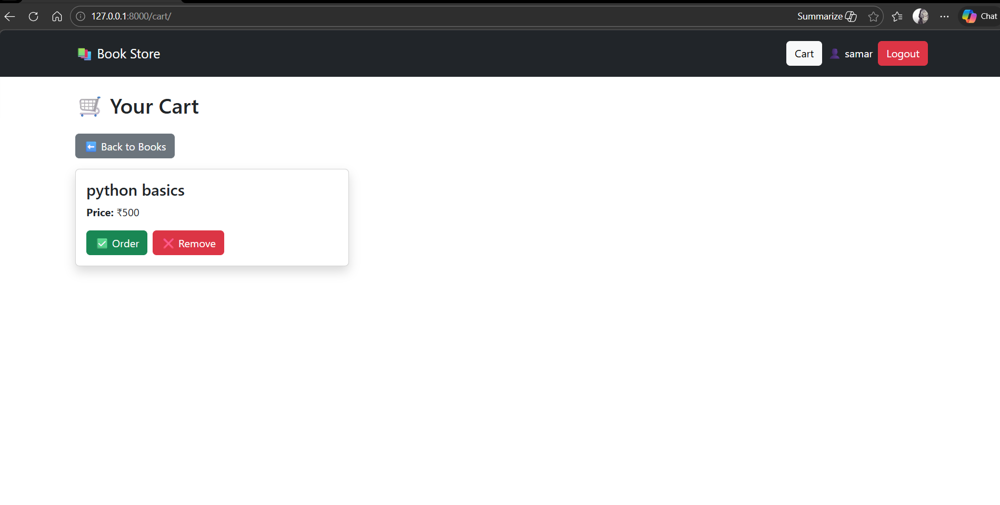

# 📚 Online Bookstore

A Django-based web application that allows users to browse, search, and manage books online.

---

## 🚀 Features
- User Registration & Login 🔐
- Browse Books 📖
- Add to Cart 🛒
- Place Orders ✅
- Simple and user-friendly interface

---

## 🛠️ Tech Stack
- Python 🐍
- Django
- HTML / CSS
- SQLite

---

## 📸 Screenshots

---

## ⚙️ Installation

1. Clone the repo:
https://github.com/Samarthrg20/OnlineBookStore.git

 2. Go to project folder:
cd OnlineBookStore

 3. Run server:
 python manage.py runserver

: 4. Open in browser:
 http://127.0.0.1:8000/
 ---

## 👨‍💻 Author
Samarth Gujar